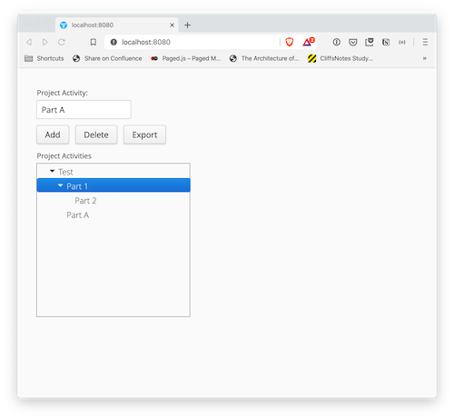

# Aimsio Java Programming Assignment
This project implements a simple web application that allows the user to create a hierarchy of activities for a project (Work break down structure). The UI is created using Vaadin framework version 8.10.

## Running the web application
To run the project, make sure you have JDK and maven installed on your machine and then run the following command in the root directory of the project:
```bash
mvn compile; mvn jetty:run
```
Then you can open a browser and access the web application through this URL: http://localhost:8080

## Using the web application
You can type a title for your project in the _Project Activity_ text box and press _Add_ button. The item will be added to the box labled **Project Activities** below. In order to add a sub activity, before pressing the Add button, select an item in the box below. 

**Project Actitivies** is a Tree structure that shows the hierarchy of project activities. 



# Assignment
We want you to make the following changes to this web application:

1- Implement the delete functionality. If the user selects an item in the box in the tree, and then presses the Delete button, the item should disappear from the tree.   

2- Implement the export button to export the hierarchy into a downloadable text file. For example the for the hierarchy in the screen shot above the text file should look like this:

export.txt:
```
Test
    Part 1
        Part 2
    Part A
```

3- (Bonus) Update the UI so that all the components stay centered as opposed to left aligned. They should stay centered even if the window is resized.


4- (Bonus) How would you test this code?

5- (Bonus) Use a database layer to persist the project hierarchy when user adds or deletes the activites. The web application should be able to show the same hierarchy as last session even when it is stopped and run again. 
 

## Important Notes
* Follow the design patterns used in the code and separate your logic from UI as much as possibe. 
* Make sure your code is readable and easy to follow.
* Make sure to refer to Vaadin Framework documentation as needed.
    * Hint: using `FileDownloader` in Vaadin might help for the second part of this assignment: https://vaadin.com/docs/v8/framework/articles/LettingTheUserDownloadAFile.html  
* If we need to do other steps to run your application, in addition to `mvn jetty:run`, please include them in your submission. 
